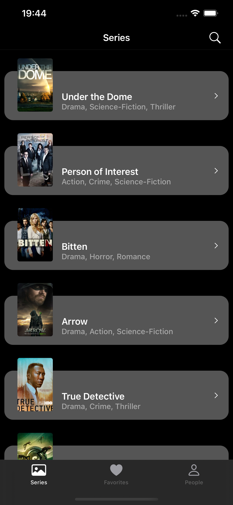
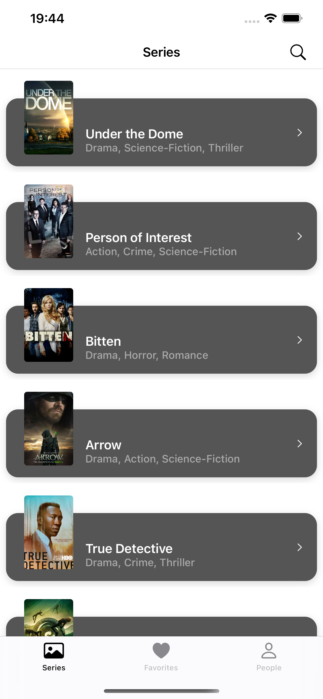

# Series Catalog
App presentes the series and related episodes available at [TV Maze API](https://www.tvmaze.com/api). Main features are:
* List all series available
* Search series by name
* See Series Details
* See Episodes Details
* Manager your favorite series
    * Add series to your favorites list
    * Delete series from your favorites list
    * Sort your favorites list by ascending, descending and insertion order
* Search for peolple.
* See the series that the person you've searched worked on.

### Demo

## Prerequisites
* [Xcode](https://developer.apple.com/xcode/) Version 13.4

## Dependency Manager
* Project uses [Swift Package Manager](https://www.swift.org/package-manager/) as the Dependency Manager.
* Dependencies used:
    * [SDWebImage](https://github.com/SDWebImage/SDWebImage)

## Run
1. Open the (SeriesCatalog.xcodeproj)[https://github.com/mcoletes/SeriesCatalog/tree/main/SeriesCatalog/SeriesCatalog.xcodeproj] with Xcode.
2. Wait for the dependencies to be installed
3. Press Run
## Architecture
* State MVVM + Combine Architecture

## UI
* App is based on pure TableView and Collections Views. To construct custom UIs, I've used Xibs for TableView and CollectionView Cells when necessary.

### Appearence
* App supports both Light and Dark Mode

Dark Mode           |  Light Mode
:-------------------------:|:-------------------------:
  |  